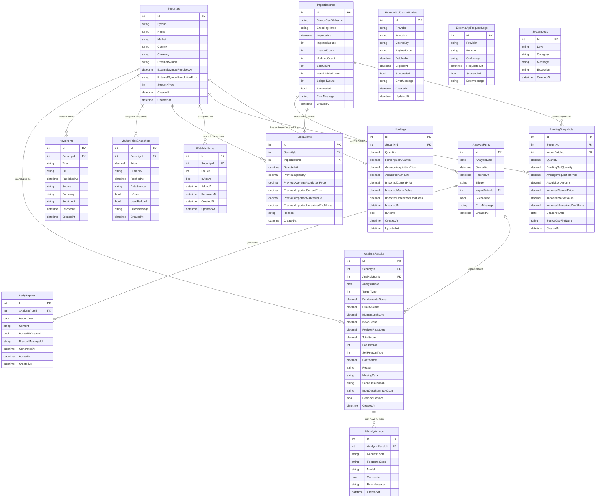

# データベースER図

このドキュメントは、現在の `BotDbContext` / EF Core migration snapshot に基づくデータベース構造をまとめます。実DBはSQLiteを想定し、列型はEF CoreのSQLiteマッピングに従います。

## 全体像

## テーブルの役割

| テーブル | 役割 |
| --- | --- |
| `Securities` | 銘柄マスタ。SBI CSVの銘柄コード、外部Provider向けシンボル、通貨・市場情報を保持します。 |
| `Holdings` | 現在の保有状態。1銘柄につき最大1行です。 |
| `HoldingSnapshots` | CSV取込時点の保有状態履歴。日次・取込ごとの記録で、可能な範囲で `ImportBatch` に紐付きます。 |
| `ImportBatches` | SBI CSV取り込みの実行単位。対象件数、作成・更新・売却検知・スキップ件数、成否を保持します。 |
| `WatchlistItems` | 監視リスト登録状態。手動追加や自動登録の出どころを保持します。 |
| `SoldEvents` | 最新CSVから消えた銘柄など、売却検知イベントの履歴です。可能な範囲で検知元の `ImportBatch` に紐付きます。 |
| `MarketPriceSnapshots` | 外部Providerなどから取得した価格スナップショットです。 |
| `NewsItems` | 銘柄に紐づく、または市場全体に関係するニュースです。 |
| `AnalysisRuns` | 日次レポート生成などの分析実行単位。分析日、開始/終了時刻、トリガー、成否を保持します。 |
| `AnalysisResults` | レポート生成時のスコアリング結果と最終判断です。`AnalysisRun` とスコア根拠JSON、入力データ概要JSONを保持します。 |
| `AiAnalysisLogs` | AI分析リクエスト/レスポンスのログです。現在の実装では補助的な履歴です。 |
| `ExternalApiCacheEntries` | 外部APIレスポンスJSONのキャッシュです。 |
| `ExternalApiRequestLogs` | 外部APIを実際に呼び出した履歴です。 |
| `DailyReports` | 生成した日次レポート本文とDiscord投稿状態です。可能な範囲で生成元の `AnalysisRun` に紐付きます。 |
| `SystemLogs` | アプリケーション内のシステムログです。 |

## リレーション

| 親 | 子 | 関係 | 外部キー | 削除動作 |
| --- | --- | --- | --- | --- |
| `Securities` | `Holdings` | 1 対 0..1 | `Holdings.SecurityId` | Cascade |
| `Securities` | `HoldingSnapshots` | 1 対 多 | `HoldingSnapshots.SecurityId` | Cascade |
| `ImportBatches` | `HoldingSnapshots` | 1 対 0..多 | `HoldingSnapshots.ImportBatchId` | SetNull |
| `Securities` | `WatchlistItems` | 1 対 多 | `WatchlistItems.SecurityId` | Cascade |
| `Securities` | `SoldEvents` | 1 対 多 | `SoldEvents.SecurityId` | Cascade |
| `ImportBatches` | `SoldEvents` | 1 対 0..多 | `SoldEvents.ImportBatchId` | SetNull |
| `Securities` | `MarketPriceSnapshots` | 1 対 多 | `MarketPriceSnapshots.SecurityId` | Cascade |
| `Securities` | `NewsItems` | 1 対 0..多 | `NewsItems.SecurityId` | 既定動作 |
| `Securities` | `AnalysisResults` | 1 対 多 | `AnalysisResults.SecurityId` | Cascade |
| `ImportBatches` | `AnalysisRuns` | 1 対 0..多 | `AnalysisRuns.ImportBatchId` | SetNull |
| `AnalysisRuns` | `AnalysisResults` | 1 対 0..多 | `AnalysisResults.AnalysisRunId` | SetNull |
| `AnalysisRuns` | `DailyReports` | 1 対 0..多 | `DailyReports.AnalysisRunId` | SetNull |
| `AnalysisResults` | `AiAnalysisLogs` | 1 対 0..多 | `AiAnalysisLogs.AnalysisResultId` | 既定動作 |

`ExternalApiCacheEntries`、`ExternalApiRequestLogs`、`SystemLogs` は、現時点では他テーブルへの外部キーを持たない独立テーブルです。

## 主な制約とインデックス

| テーブル | 制約 / インデックス |
| --- | --- |
| `Securities` | `SecurityType + Symbol` に一意インデックス。`Symbol` は最大32文字、`Name` は最大256文字、`ExternalSymbol` は最大64文字。 |
| `Holdings` | `SecurityId` に一意インデックス。1銘柄につき現在保有は最大1行。数量・取得単価・評価額系は `decimal(18,4)`。 |
| `HoldingSnapshots` | `SecurityId + SnapshotDate`、`ImportBatchId` にインデックス。数量・取得単価・評価額系は `decimal(18,4)`。 |
| `ImportBatches` | `ImportedAt` にインデックス。`SourceCsvFileName` は最大256文字、`EncodingName` は最大64文字、`ErrorMessage` は最大2048文字。 |
| `WatchlistItems` | `SecurityId + IsActive` にインデックス。 |
| `SoldEvents` | `SecurityId`、`ImportBatchId` にインデックス。 |
| `MarketPriceSnapshots` | `SecurityId + FetchedAt`、`SecurityId + DataSource + FetchedAt` にインデックス。`DataSource` は最大64文字、`Currency` は最大16文字。 |
| `NewsItems` | `SecurityId + PublishedAt`、`Source + PublishedAt`、`Url` にインデックス。`SecurityId` はnullableで、市場全体ニュースも保存できます。`Source` は最大128文字。 |
| `AnalysisRuns` | `AnalysisDate + StartedAt`、`ImportBatchId` にインデックス。`Trigger` は最大64文字、`ErrorMessage` は最大2048文字。 |
| `AnalysisResults` | `SecurityId + AnalysisDate + TargetType`、`AnalysisRunId` にインデックス。 |
| `AiAnalysisLogs` | `AnalysisResultId` にインデックス。 |
| `ExternalApiCacheEntries` | `Provider + Function + CacheKey` に一意インデックス、`ExpiresAt` にインデックス。`Provider` / `Function` は最大64文字、`CacheKey` は最大256文字。 |
| `ExternalApiRequestLogs` | `Provider + RequestedAt` にインデックス。`Provider` / `Function` は最大64文字、`CacheKey` は最大256文字。 |
| `DailyReports` | `ReportDate`、`AnalysisRunId` にインデックス。 |
| `SystemLogs` | `CreatedAt` にインデックス。 |

## Enum値

DB上では以下のenumは `INTEGER` として保存されます。

| Enum | 値 |
| --- | --- |
| `SecurityType` | `Unknown = 0`, `Stock = 1` |
| `TargetType` | `Holding = 0`, `Watchlist = 1` |
| `WatchlistSource` | `Manual = 0`, `SoldAutomatically = 1` |
| `BotDecision` | `BuyMore = 0`, `Hold = 1`, `PartialTakeProfit = 2`, `TakeProfit = 3`, `PartialStopLoss = 4`, `StopLoss = 5`, `AnalysisFailed = 6`, `NewBuy = 7`, `Skip = 8` |
| `SellReasonType` | `None = 0`, `TakeProfit = 1`, `StopLoss = 2`, `Rebalance = 3`, `FundamentalDeterioration = 4`, `RiskAvoidance = 5` |

## 補足

- 現在のスキーマ定義は `src/InvestmentDecisionBot.Infrastructure/Persistence/BotDbContext.cs` と `src/InvestmentDecisionBot.Infrastructure/Persistence/Migrations/BotDbContextModelSnapshot.cs` が基準です。
- `DateOnly` / `DateTimeOffset` はSQLiteでは `TEXT` として保存されます。
- `MarketPriceSnapshots.FetchedAt` は、当日再利用判定のLINQ日付範囲検索をSQLite側で実行できるよう、EF Coreで文字列変換を明示しています。
- `AnalysisResult.ScoreDetailsJson` と `AnalysisResult.InputDataSummaryJson` はSQLiteの `TEXT` として保存されます。スコア根拠や入力データ概要の追跡用で、現時点では子テーブルへ正規化していません。
- EF Coreのnullable設定により、`SecurityId` がnullableでない子テーブルは必須リレーションです。`ImportBatchId`、`AnalysisRunId`、`NewsItems.SecurityId`、`AiAnalysisLogs.AnalysisResultId` はnullableです。
