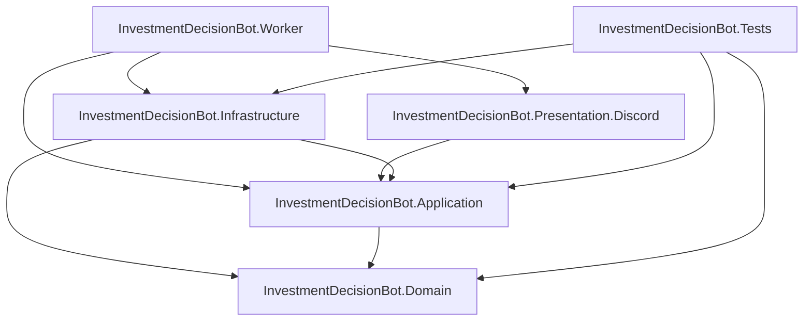

# プロジェクト依存関係

この文書は、現状の `*.csproj`、DI 登録、主要な実装配置をもとにしたプロジェクト間依存関係の整理です。

## 全体構成

依存の中心は `Application` の抽象インターフェースです。`Infrastructure` は永続化・外部データなどの抽象を実装し、`Presentation.Discord` は Discord 入出力を担当します。`Worker` は実行ホストとして各レイヤの DI 登録を組み合わせます。

## レイヤ別の役割

| プロジェクト | 主な役割 | 依存先 |
| --- | --- | --- |
| `InvestmentDecisionBot.Domain` | エンティティ、列挙型などのドメインモデル | なし |
| `InvestmentDecisionBot.Application` | ユースケース、DTO、抽象インターフェース、スコアリング、レポート生成 | `Domain` |
| `InvestmentDecisionBot.Infrastructure` | DB、CSV、外部マーケットデータ、ログなどの具体実装 | `Application`, `Domain` |
| `InvestmentDecisionBot.Presentation.Discord` | Discord Bot、Slash Command、Discord 投稿、Embed 整形 | `Application` |
| `InvestmentDecisionBot.Worker` | ホスト起動、設定読み込み、Worker 固有 HostedService、スケジューリング | `Application`, `Infrastructure`, `Presentation.Discord` |
| `InvestmentDecisionBot.Tests` | ユニットテスト、結合寄りテスト、SQLite/InMemory を使った検証 | `Application`, `Infrastructure`, `Domain` |

## プロジェクト参照

### `InvestmentDecisionBot.Domain`

`src/InvestmentDecisionBot.Domain/InvestmentDecisionBot.Domain.csproj`

- 他プロジェクトへの参照なし
- `net10.0`

### `InvestmentDecisionBot.Application`

`src/InvestmentDecisionBot.Application/InvestmentDecisionBot.Application.csproj`

- `InvestmentDecisionBot.Domain`

主な配置:

- `Abstractions/`: Repository / UnitOfWork、CSV パーサ、各種 Provider/Service 抽象
- `DTOs/`: 入出力 DTO
- `Importing/`, `Watchlist/`, `Reporting/`, `Scoring/`: アプリケーションサービス
- `DependencyInjection.cs`: Application 層の DI 登録
- `IImportBatchRepository` / `IAnalysisRunRepository`: CSV取り込み単位と分析実行単位を永続化するための抽象
- `IReportRunCoordinator`: レポート生成の同時実行を防ぐための抽象

### `InvestmentDecisionBot.Infrastructure`

`src/InvestmentDecisionBot.Infrastructure/InvestmentDecisionBot.Infrastructure.csproj`

- `InvestmentDecisionBot.Application`
- `InvestmentDecisionBot.Domain`

主な配置:

- `Persistence/`: `BotDbContext`、EF Core migrations、Repository 実装
- `Csv/`: SBI CSV パーサ実装
- `Providers/`: `JQuantsMarketDataProvider`、Null Provider 群
- `Services/`: システムログ実装
- `DependencyInjection.cs`: Infrastructure 層の DI 登録

### `InvestmentDecisionBot.Presentation.Discord`

`src/InvestmentDecisionBot.Presentation.Discord/InvestmentDecisionBot.Presentation.Discord.csproj`

- `InvestmentDecisionBot.Application`

主な配置:

- `HostedServices/`: Discord Bot の起動、停止、Slash Command 処理
- `Options/`: Discord Bot の起動設定
- `Publishing/`: Discord へのレポート投稿
- `DependencyInjection.cs`: Discord Presentation 層の DI 登録

### `InvestmentDecisionBot.Worker`

`src/InvestmentDecisionBot.Worker/InvestmentDecisionBot.Worker.csproj`

- `InvestmentDecisionBot.Application`
- `InvestmentDecisionBot.Infrastructure`
- `InvestmentDecisionBot.Presentation.Discord`

主な配置:

- `Program.cs`: `AddApplication()`、`AddInfrastructure()`、`AddDiscordPresentation()` を呼び出す起動点
- `HostedServices/`: DB 初期化、日次レポートスケジューラ
- `Scheduling/`: レポート実行調整
- `Configuration/`: `.env` 読み込み拡張

### `InvestmentDecisionBot.Tests`

`tests/InvestmentDecisionBot.Tests/InvestmentDecisionBot.Tests.csproj`

- `InvestmentDecisionBot.Application`
- `InvestmentDecisionBot.Infrastructure`
- `InvestmentDecisionBot.Domain`

主なテスト対象:

- CSV 取り込み
- スコアリング
- レポート生成
- ウォッチリスト
- J-Quants Provider
- Infrastructure の DI 登録

## DI 依存関係

### Application 層の登録

`src/InvestmentDecisionBot.Application/DependencyInjection.cs`

| 抽象 | 実装 |
| --- | --- |
| `IScoreCalculator` | `ScoreCalculator` |
| `IBotDecisionResolver` | `BotDecisionResolver` |
| `IImportService` | `ImportService` |
| `IWatchlistService` | `WatchlistService` |
| `IReportService` | `ReportService` |

### Infrastructure 層の登録

`src/InvestmentDecisionBot.Infrastructure/DependencyInjection.cs`

| 抽象/サービス | 実装/登録内容 |
| --- | --- |
| `BotDbContext` | `DATABASE_PROVIDER=InMemory` の場合は InMemory、それ以外は SQLite |
| Repository / UnitOfWork | `Ef*Repository` / `EfUnitOfWork`。`ImportBatch` と `AnalysisRun` のRepositoryもここで登録します。 |
| `ISbiCsvParser` | `SbiCsvParser` |
| `ISystemLogService` | `SystemLogService` |
| `HttpClient` | 名前付きクライアント `ExternalMarketData` |
| `IMarketDataProvider` | `JQuantsMarketDataProvider` または `NullMarketDataProvider` |
| `ICachedMarketDataProvider` | `JQuantsMarketDataProvider` または `NullMarketDataProvider` |
| `IFinancialDataProvider` | `JQuantsMarketDataProvider` または `NullFinancialDataProvider` |
| `IMarketDataPrefetchService` | `JQuantsMarketDataProvider` または `NullMarketDataProvider` |
| `INewsProvider` | `NullNewsProvider` |
| `IExchangeRateProvider` | `NullExchangeRateProvider` |

Provider の切り替えは `MARKET_DATA_PROVIDER` で行います。

- 未指定: `JQuants`
- `JQuants`: `JQuantsMarketDataProvider`
- `Null` または `Disabled`: Null Provider 群

DB の切り替えは `DATABASE_PROVIDER` で行います。

- `InMemory`: EF Core InMemory
- 未指定またはその他: SQLite

SQLite の DB パスは `DATABASE_PATH`、または接続文字列 `Default`、または既定値 `data/investment-decision-bot.db` が使われます。

### Presentation.Discord 層の登録

`src/InvestmentDecisionBot.Presentation.Discord/DependencyInjection.cs`

| 抽象/サービス | 実装/登録内容 |
| --- | --- |
| `DiscordSocketClient` | Singleton |
| `DiscordOptions` | `DISCORD_TOKEN`, `DISCORD_GUILD_ID`, `DISCORD_CHANNEL_ID` から設定 |
| `IDiscordReportPublisher` | `DiscordReportPublisher` |
| `DiscordBotHostedService` | HostedService |

### Worker 層の登録

`src/InvestmentDecisionBot.Worker/Program.cs`

| サービス | ライフタイム |
| --- | --- |
| `IReportRunCoordinator` | `ReportRunCoordinator` Singleton |
| `DatabaseInitializerHostedService` | HostedService |
| `DailyReportSchedulerHostedService` | HostedService |

起動時には以下の順で登録されます。

1. `.env` と環境変数の読み込み
2. `AddApplication()`
3. `AddInfrastructure(builder.Configuration)`
4. `AddDiscordPresentation(builder.Configuration)`
5. Worker 固有サービスの登録

## NuGet パッケージ依存

| プロジェクト | パッケージ |
| --- | --- |
| `Domain` | なし |
| `Application` | `Microsoft.Extensions.DependencyInjection.Abstractions 10.0.9` |
| `Infrastructure` | `Microsoft.EntityFrameworkCore.Design 10.0.9`, `Microsoft.EntityFrameworkCore.InMemory 10.0.9`, `Microsoft.EntityFrameworkCore.Sqlite 10.0.9`, `Microsoft.Extensions.Http 10.0.9`, `SQLitePCLRaw.bundle_e_sqlite3 3.0.3` |
| `Presentation.Discord` | `Discord.Net 3.20.1`, `Microsoft.Extensions.Configuration.Abstractions 10.0.9`, `Microsoft.Extensions.DependencyInjection.Abstractions 10.0.9`, `Microsoft.Extensions.Hosting.Abstractions 10.0.1`, `Microsoft.Extensions.Logging.Abstractions 10.0.9`, `Microsoft.Extensions.Options 10.0.9` |
| `Worker` | `Microsoft.EntityFrameworkCore.Design 10.0.9`, `Microsoft.Extensions.Hosting 10.0.1` |
| `Tests` | `coverlet.collector 6.0.4`, `Microsoft.EntityFrameworkCore.Sqlite 10.0.9`, `Microsoft.NET.Test.Sdk 17.14.1`, `SQLitePCLRaw.bundle_e_sqlite3 3.0.3`, `xunit 2.9.3`, `xunit.runner.visualstudio 3.1.4` |

## 外部サービス依存

| 外部要素 | 利用箇所 | 備考 |
| --- | --- | --- |
| SQLite | `Infrastructure.Persistence.BotDbContext` | 既定の永続化先 |
| EF Core InMemory | `Infrastructure.DependencyInjection` | `DATABASE_PROVIDER=InMemory` で利用 |
| J-Quants API | `Infrastructure.Providers.JQuantsMarketDataProvider` | `MARKET_DATA_PROVIDER=JQuants` で利用 |
| Discord | `Presentation.Discord` | `DISCORD_TOKEN`, `DISCORD_GUILD_ID`, `DISCORD_CHANNEL_ID` を利用 |
| `.env` / 環境変数 | `Worker.Configuration` / `Program.cs` | 起動時設定 |

## 依存方向のルール

- `Domain` は最下層で、他レイヤに依存しません。
- `Application` は `Domain` にだけ依存し、外部サービスや具体的な永続化方式は抽象で扱います。
- `Infrastructure` は `Application` の抽象を実装します。
- `Presentation.Discord` は `Application` の抽象を通してユースケースを呼び出し、Discord 固有の入出力を担当します。
- `Worker` は実行ホストとして、`Application`、`Infrastructure`、`Presentation.Discord` を組み合わせます。
- `Tests` は検証のために各レイヤを参照します。

新しい機能を追加する場合は、まず `Application.Abstractions` に必要な抽象を置き、永続化・外部データの具体実装は `Infrastructure`、UI / 入出力の具体実装は該当する Presentation 層に置くと現在の依存方向を保ちやすくなります。
